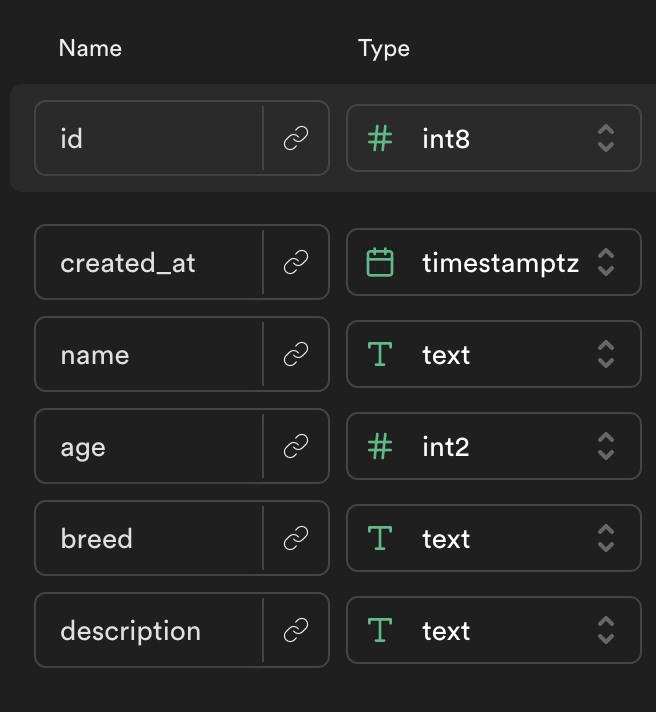

# Rubric

Here is the model for the `dogs` table

| Tasks...                                                                                       | **10** |
| ---------------------------------------------------------------------------------------------- | ------ |
| ASYNC: `getDogs()` : return array of dogs from supabase                                        | 2      |
| On load on the home page, see a list of dogs (names and breed image), fetched from supabase    | 2      |
| On clicking a dog, user should be taken to that dog's detail page.                             | 2      |
| ASYNC: `getDog(id)` : return single dog from supabase                                          | 2      |
| Detail page should get the id from the URL and use that id to fetch that dog from supabase.    | 2      |
| Detail page should show the user details about the dog (including age, breed, and description) | 2      |
